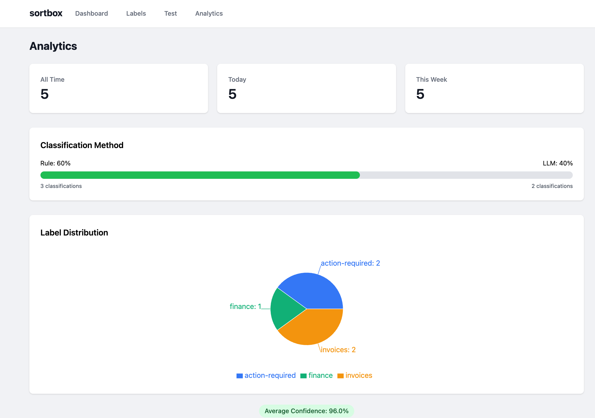
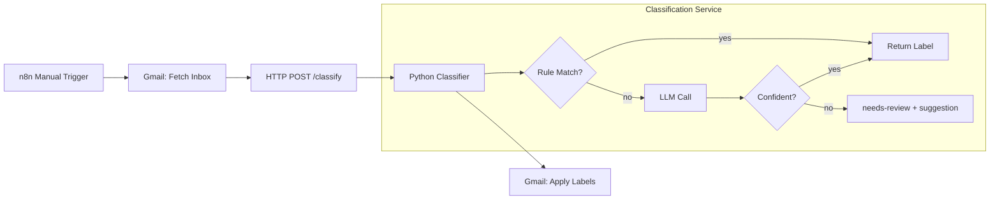

# sortbox

[](https://www.python.org/downloads/)
[](https://www.gnu.org/licenses/gpl-3.0)
[](https://github.com/astral-sh/ruff)

Smart email organization powered by rule-based matching and LLM intelligence. Automatically classifies and labels Gmail messages using an n8n workflow + Python service.



## Features

### Current (v1.0)
- **Rule-based classification** - Fast pattern matching on sender/subject
- **LLM fallback** - Claude/OpenAI/Ollama for edge cases
- **10 label categories** - Finance, newsletters, travel, security, etc.
- **n8n integration** - Manual trigger workflow
- **Analytics dashboard** - Real-time classification tracking and insights
- **98% test coverage** - Comprehensive test suite
- **Docker ready** - Containerized deployment

## Architecture



## Quick Start

### Prerequisites
- Python 3.12+
- [uv](https://github.com/astral-sh/uv) package manager
- Gmail account with API access
- Anthropic/OpenAI API key (or local Ollama)

### Installation

```bash
# Clone repository
git clone https://github.com/mangobanaani/sortbox.git
cd sortbox

# Install dependencies
make install

# Configure environment
export ANTHROPIC_API_KEY=sk-...  # or OPENAI_API_KEY

# Edit labels.yaml with your categories
cp labels.yaml labels.yaml.example
vim labels.yaml

# Run service
make run
```

Service will be available at `http://127.0.0.1:8000`

## Web Interface

Access the web interface at `http://127.0.0.1:8000` when running the service.

### Features

- **Dashboard**: Overview of labels and recent activity
- **Analytics**: Real-time classification tracking and insights
  - Classification volume (all-time, today, this week)
  - Rule vs LLM method breakdown
  - Label distribution with interactive charts
  - Average confidence scores
  - Auto-refresh every 30 seconds
- **Label Editor**: Create, edit, and delete labels without touching YAML
- **Rule Builder**: Visual interface for adding classification rules
- **Test Console**: Test email classification in real-time
- **Hot Reload**: Changes to labels.yaml automatically reload

### Development

Run backend and frontend separately for development:

```bash
# Terminal 1: Backend
make run

# Terminal 2: Frontend
cd frontend
npm install
npm run dev
```

Frontend dev server runs on http://localhost:5173 with API proxy to backend.

### Production

Build frontend and serve from FastAPI:

```bash
cd frontend
npm run build
cd ..
make run
```

Access UI at http://127.0.0.1:8000

## Configuration

### labels.yaml

Define your label taxonomy with rules and LLM fallback:

```yaml
labels:
  finance:
    description: "Invoices, receipts, payment confirmations"
    rules:
      - from: "*@stripe.com"
      - from: "*@paypal.com"
      - subject_contains: ["invoice", "receipt", "payment"]

  action-required:
    description: "Emails that need a reply or action"
    rules: []  # LLM-only, no rules

settings:
  llm_provider: "claude"  # claude | openai | ollama
  confidence_threshold: 0.7
  max_emails_per_run: 100
```

Labels with rules get fast pattern matching. Labels with empty rules rely entirely on LLM with context from descriptions.

## Development

### Commands

```bash
make install    # Install dependencies
make test       # Run pytest (98% coverage)
make lint       # Ruff linting
make typecheck  # Mypy strict type checking
make security   # Bandit + Safety scans
make format     # Auto-fix formatting
make check      # Run all checks (CI simulation)
make run        # Start development server
```

### Testing

```bash
# Run all tests with coverage
uv run pytest --cov=src --cov-report=term-missing -v

# Run specific test file
uv run pytest tests/test_rules.py -v

# Run with verbose output
uv run pytest -vv
```

**Coverage:** 98% overall (target: 80% minimum)

### Project Structure

```
sortbox/
├── frontend/                  # React UI
│   ├── src/
│   │   ├── components/        # Reusable UI components
│   │   ├── pages/             # Page components
│   │   ├── hooks/             # React Query hooks
│   │   ├── lib/               # API client and utilities
│   │   └── App.tsx
│   ├── package.json
│   └── vite.config.ts
├── src/
│   ├── api/                   # API routers for UI
│   │   ├── analytics.py       # Analytics endpoint
│   │   ├── labels.py          # Label CRUD
│   │   └── models.py          # API schemas
│   ├── database.py            # SQLite analytics storage
│   ├── config_watcher.py      # Hot-reload logic
│   ├── main.py                # FastAPI application entrypoint
│   ├── models.py              # Pydantic request/response schemas
│   ├── config.py              # YAML config loader
│   └── classifier/
│       ├── rules.py           # Rule-based matching engine
│       ├── llm_classifier.py  # LLM fallback logic
│       ├── service.py         # FastAPI service
│       └── providers/
│           ├── base.py        # LLMProvider protocol
│           ├── claude.py      # Anthropic implementation
│           ├── openai_provider.py # OpenAI implementation
│           └── ollama_provider.py # Ollama implementation
├── tests/                     # 34 tests, 98% coverage
├── n8n/
│   ├── workflow.json          # Basic classifier workflow
│   └── orchestrator.json      # Full automation (planned)
├── docs/
│   └── plans/                 # Design & implementation plans
├── labels.yaml                # Label taxonomy config
├── Makefile                   # Development commands
├── Dockerfile                 # Container image
├── docker-compose.yml         # Local stack
└── .github/workflows/         # CI/CD pipelines
```

## Docker Deployment

### Build and Run

```bash
# Build image
docker build -t sortbox:latest .

# Run container
docker run -d \
  -p 8000:8000 \
  -v $(pwd)/data:/app/data \
  -e ANTHROPIC_API_KEY=sk-... \
  --name sortbox \
  sortbox:latest
```

### Docker Compose

```bash
# Set up environment variables
cp .env.example .env
# Edit .env and add your API keys

# Start stack
docker-compose up -d

# View logs
docker-compose logs -f sortbox

# Stop stack
docker-compose down

# Rebuild after code changes
docker-compose up -d --build
```

## n8n Integration

### Setup

1. **Import workflow**: In n8n, import `n8n/workflow.json`
2. **Configure Gmail**: Set up Gmail OAuth2 credentials
3. **Update URL**: Point HTTP Request node to your sortbox instance
4. **Activate**: Enable workflow in n8n

### Workflow Structure

```
Manual Trigger
  → Gmail: Fetch unprocessed inbox
  → HTTP POST /classify
  → Split results
  → Gmail: Apply labels
  → Gmail: Mark as processed
```

## API Reference

### Endpoints

#### `POST /classify`

Classify a batch of emails.

**Request:**
```json
{
  "emails": [
    {
      "email_id": "msg001",
      "sender": "billing@stripe.com",
      "subject": "Invoice #1234",
      "body_preview": "Your invoice for January is ready. Amount: $49.00"
    }
  ]
}
```

**Response:**
```json
{
  "results": [
    {
      "email_id": "msg001",
      "labels": ["finance"],
      "confidence": 1.0,
      "suggestion": null
    }
  ]
}
```

#### `GET /health`

Health check endpoint.

**Response:**
```json
{
  "status": "ok"
}
```

#### `GET /api/analytics`

Get classification analytics.

**Response:**
```json
{
  "total_all_time": 150,
  "total_today": 12,
  "total_this_week": 45,
  "by_label": {
    "finance": 30,
    "newsletters": 25,
    "action-required": 20
  },
  "rule_classifications": 90,
  "llm_classifications": 60,
  "avg_confidence": 0.92
}
```

## Label Categories

The default `labels.yaml` includes 10 categories:

| Label | Description | Rules |
|-------|-------------|-------|
| `finance` | Invoices, receipts, payments | Stripe, PayPal, keywords |
| `newsletters` | Subscribed content | Unsubscribe header, keywords |
| `action-required` | Needs reply/action | LLM-only |
| `notifications` | Service alerts | GitHub, CI/CD, monitoring |
| `shipping` | Package tracking | Carriers, tracking keywords |
| `travel` | Flights, hotels | Booking sites, itinerary |
| `security` | Login alerts, 2FA | Password, verify, alert |
| `social` | Personal messages | LLM-only |
| `promotions` | Marketing, sales | Discount keywords |
| `calendar` | Meeting invites | Invitation, event, RSVP |


## Contributing

Contributions welcome! Please:

1. Fork the repository
2. Create a feature branch (`git checkout -b feature/amazing`)
3. Make changes with tests (`make test`)
4. Ensure all checks pass (`make check`)
5. Commit with clear messages
6. Push and open a pull request

## License

GNU General Public License v3.0 - see LICENSE file for details.

## Acknowledgments

- Built with [FastAPI](https://fastapi.tiangolo.com/)
- Powered by [uv](https://github.com/astral-sh/uv)
- Orchestrated by [n8n](https://n8n.io/)
- LLM support via [Anthropic](https://www.anthropic.com/), [OpenAI](https://openai.com/), and [Ollama](https://ollama.ai/)
